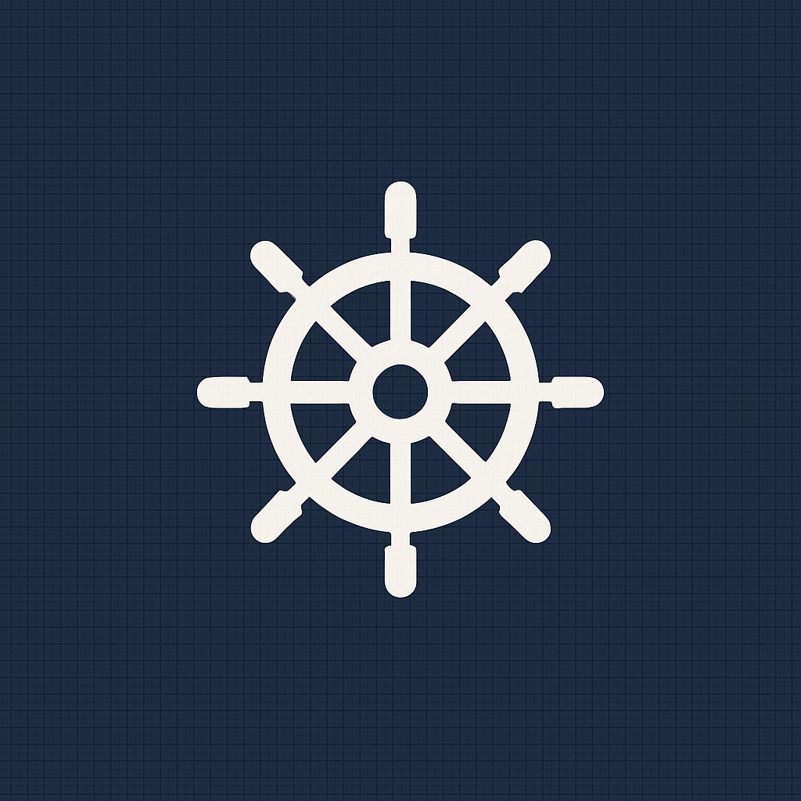

<div align="center">
  

  <h1>Captan</h1>

  <p>Command your ownership.</p>
  <h3>Open Source Cap Table Management CLI</h3>

  [](https://www.npmjs.com/package/captan)
  [](https://www.npmjs.com/package/captan)
  [](https://github.com/acossta/captan/actions/workflows/main.yml)
  [](https://coveralls.io/github/acossta/captan?branch=main)
  [](https://github.com/acossta/captan)
  [](LICENSE)
</div>

---

## ✨ Overview
Captan is a lightweight, hackable CLI tool for managing startup **cap tables**.
Keep ownership records simple and transparent with a single JSON file (`captable.json`).

- 🪶 Zero database required — just git & JSON
- 📊 Real cap table math: outstanding vs fully diluted
- ⏳ Simple vesting schedules with cliffs
- 📜 Audit log for every action
- 📤 Export to CSV/JSON for investors & lawyers

---

## 📖 Usage

Captan uses a resource-oriented command structure.

### Stakeholder Commands
```bash
captan stakeholder add --name "Alice" --email "alice@example.com" [--entity PERSON]
captan stakeholder list [--format json]
captan stakeholder show [id-or-email]
captan stakeholder update [id-or-email] [--name "New Name"] [--email "new@example.com"]
captan stakeholder delete [id-or-email]
```

### Security Class Commands
```bash
captan security add --kind COMMON --label "Common Stock" [--authorized 10000000]
captan security list [--format json]
captan security show [id]
captan security update [id] [--authorized 20000000]
captan security delete [id]
```

### Issuance Commands
```bash
captan issuance add --stakeholder <id-or-email> --security <id> --qty 1000000
captan issuance list [--stakeholder id-or-email] [--format json]
captan issuance show [id]
captan issuance update [id] [--qty 2000000]
captan issuance delete [id]
```

### Option Grant Commands
```bash
captan grant add --stakeholder <id-or-email> --qty 100000 --exercise 0.10
captan grant list [--stakeholder id-or-email] [--format json]
captan grant show [id]
captan grant update [id] [--vesting-start 2024-06-01]
captan grant delete [id]
```

### SAFE Commands
```bash
captan safe add --stakeholder <id-or-email> --amount 100000 [--cap 5000000]
captan safe list [--stakeholder id-or-email] [--format json]
captan safe show [id]
captan safe update [id] [--discount 20]
captan safe delete [id]
captan safe convert --pre-money 10000000 --pps 2.00 [--dry-run]
```

### Report Commands
```bash
captan report summary [--format json]
captan report ownership [--date 2024-01-01]
captan report stakeholder [id-or-email]
captan report security [id]
```

### Export Commands
```bash
captan export csv [--output captable.csv]
captan export json [--output captable.json]
captan export pdf [--output captable.pdf]
```

### System Commands
```bash
captan init [--wizard] [--name "Company"] [--authorized 10000000]
captan validate [--extended] [--file captable.json]
captan schema [--output captable.schema.json]
captan log [--action ISSUANCE_ADD] [--limit 10]
captan version
captan help [command]
```

---

## 🚀 QuickStart

### Install
Use npx (no install):
```bash
npx captan@latest --help
```

Or install globally:
```bash
npm install -g captan
captan --help
```

> Requires Node.js 20+

### Updating

If you have captan installed globally:
```bash
# Check current version
captan --version

# Update to latest version
npm install -g captan@latest

# Verify update
captan --version
```

If you're using npx, it always fetches the latest by default:
```bash
npx captan@latest --version
```

> 💡 **Note**: `npm update -g captan` doesn't work for global packages. You must use `npm install -g captan@latest` to update.

### One-minute flow

```bash
# 1. Initialize with founders and pool (C-Corp with 20% pool)
captan init \
  --name "Acme, Inc." \
  --date "2024-01-15" \
  --authorized 10000000 \
  --founder "Alice Founder:alice@acme.com:5000000" \
  --founder "Bob Engineer:bob@acme.com:3000000" \
  --pool-pct 20

# 2. Grant options from the pool
captan grant add --stakeholder sh_bob --qty 200000 --exercise 0.10

# 3. View your cap table
captan report ownership

# 4. Export to CSV
captan export csv > captable.csv
```

> 💡 **IDE Support**: Captan automatically creates `captable.schema.json` for autocomplete and validation in VS Code and other editors that support JSON Schema.

### Interactive Setup

```bash
# Use the wizard for guided setup
captan init --wizard

# Prompts you through:
# - Company name & type (C-Corp, S-Corp, LLC)
# - State of incorporation
# - Authorized shares/units
# - Option pool configuration
# - Founder equity splits
```

### 💰 SAFE Support

```bash
# Add a SAFE investment
captan safe add \
  --stakeholder sh_alice \
  --amount 100000 \
  --cap 5000000 \
  --discount 20 \
  --note "YC SAFE"

# List all SAFEs
captan safe list

# Convert SAFEs at Series A (permanent - SAFEs become shares)
captan safe convert \
  --pre-money 10000000 \
  --new-money 3000000 \
  --pps 2.00
```

### 📊 Sample Output
```yaml
📊 Captan — Cap Table (as of 2025-08-16)
Name                      Outstanding    %
Alice Founder                  5000000   96.15%
Bob Eng                          80000    1.54%

Totals
Issued equity:       5000000
Vested options:      80000
Outstanding total:   5080000
FD issued:           5000000
FD grants:           200000
FD pool remaining:   1800000
Fully diluted total: 7000000
```

## 🧩 Features

- **Stakeholder management**
- **Security classes** (common, preferred, option pools)
- **Share issuances**
- **Option grants & vesting schedules**
- **SAFE investments** (with cap, discount, conversion simulation)
- **Cap table reports** (outstanding & FD, with SAFEs)
- **Export CSV/JSON**
- **Audit history** (the "ship's log")

## 📋 JSON Schema & Validation

Captan provides enterprise-grade JSON schema validation with comprehensive error checking and IDE integration.

### ✨ Key Features

- 🔍 **Format Validation**: Automatic validation of dates, emails, UUIDs, currency codes
- 🧠 **Business Rules**: Cross-entity reference checking, authorized share limits, duplicate detection
- 💡 **IDE Support**: Real-time autocomplete and validation in VS Code and other editors
- ⚠️ **Smart Warnings**: Non-critical issues flagged separately from errors
- 📊 **Enterprise Ready**: Handles complex cap tables with comprehensive validation

### 🚀 Usage

```bash
# Basic validation - checks format and structure
captan validate

# Extended validation - includes business rules and cross-references
captan validate --extended

# Generate schema file for IDE integration
captan schema --output captable.schema.json

# Validate a specific file
captan validate --file my-captable.json
```

### 💻 IDE Integration

When you run `captan init`, a `captable.schema.json` file is automatically created in your directory. This enables:

- **Autocomplete**: IntelliSense for all captable properties
- **Real-time validation**: Immediate error highlighting
- **Documentation**: Hover hints with field descriptions
- **Type safety**: Prevents common data entry errors

### 🎯 Validation Examples

**Format validation:**
```bash
$ captan validate
❌ Validation failed for captable.json:
  • company.formationDate: Date must be in YYYY-MM-DD format
  • stakeholders[0].email: Invalid email format
  • company.currency: String must contain exactly 3 characters
```

**Business rule validation:**
```bash
$ captan validate --extended
❌ Validation failed for captable.json:
  • issuances[0].stakeholderId: Invalid stakeholder reference 'sh_nonexistent'
  • securityClasses[0]: Issued shares (1,100,000) exceed authorized (1,000,000)

⚠️ Warnings:
  • stakeholders[2]: Stakeholder has no equity, options, or SAFEs
  • safes[0]: SAFE has neither cap nor discount - conversion may be problematic
```

### 🔧 What Gets Validated

| Category | Basic Mode | Extended Mode |
|----------|------------|---------------|
| **Format** | ✅ Dates, emails, UUIDs | ✅ All format validation |
| **Structure** | ✅ Required fields, types | ✅ All structural validation |
| **References** | ❌ | ✅ Stakeholder/security class refs |
| **Business Rules** | ❌ | ✅ Share limits, duplicate IDs |
| **Consistency** | ❌ | ✅ Date ordering, pool usage |
| **Warnings** | ❌ | ✅ Orphaned entities, missing terms |

## Concepts

### Outstanding vs Fully Diluted
- **Outstanding** = issued equity (common + preferred) + **vested** options
- **Fully diluted** = issued equity + **all granted options** + **remaining option pool**

### Vesting
Options vest monthly with cliff periods:
- Standard: 4 years (48 months) with 1-year cliff
- Options don't count as outstanding until vested
- Full grant counts toward fully diluted from day one

### SAFE Conversions
SAFEs (Simple Agreement for Future Equity) are placeholder investments that convert to shares at a priced round.

#### How SAFEs Work:
1. **Investment**: Investor provides capital via SAFE (not equity yet)
2. **Terms**: SAFEs can have a valuation cap and/or discount
3. **Conversion**: At next priced round, SAFEs convert to shares
4. **Price**: Converts at the LOWEST of:
   - **Round price**: The actual price per share
   - **Cap price**: Valuation cap ÷ pre-money shares
   - **Discount price**: Round price × (1 - discount%)
5. **Permanent**: After conversion, SAFEs disappear - replaced by share issuances

#### Pre-money vs Post-money SAFEs:
- **Pre-money**: Cap applies to company value BEFORE the SAFE money
- **Post-money**: Cap includes the SAFE investment itself (YC standard)

#### Example SAFE Lifecycle:
```bash
# 1. Add SAFEs during seed stage
captan safe add --stakeholder sh_angel --amount 50000 --cap 5000000 --discount 20
captan safe add --stakeholder sh_vc --amount 150000 --cap 8000000

# 2. Check outstanding SAFEs
captan safe list
# Shows: $200k in SAFEs outstanding

# 3. PREVIEW conversion (no changes made) - NEW!
captan safe convert --pre-money 10000000 --pps 2.00 --dry-run

# Output:
# 🔄 SAFE Conversion Preview
# 
# Angel Investor:
#   Investment: $50,000
#   Shares: 31,250 at $1.60/share (discount)
#   New ownership: 1.2%
#
# VC Fund:
#   Investment: $150,000  
#   Shares: 75,000 at $2.00/share (cap)
#   New ownership: 2.8%
#
# Total new shares: 106,250
# Post-money shares: 2,606,250
# Dilution to existing: 4.1%

# 4. EXECUTE conversion (permanent)
captan safe convert --pre-money 10000000 --pps 2.00

# Conversion calculation for sh_angel:
# - Round price: $2.00
# - Cap price: $5M ÷ 2.5M shares = $2.00  
# - Discount price: $2.00 × 0.8 = $1.60 ← BEST PRICE
# - Converts: $50k ÷ $1.60 = 31,250 shares

# 5. SAFEs are now gone
captan safe list
# Shows: No SAFEs outstanding

captan report ownership
# Shows: sh_angel now owns shares, not a SAFE
```

#### Simulating Different Conversion Scenarios:
```bash
# Test different valuations without committing
captan safe convert --pre-money 8000000 --pps 1.60 --dry-run
captan safe convert --pre-money 12000000 --pps 2.40 --dry-run
captan safe convert --pre-money 15000000 --pps 3.00 --dry-run

# Compare which pricing terms apply at different valuations
# Higher valuations may trigger cap prices
# Lower valuations may make discount prices more favorable
```

### Data Storage
All data lives in `captable.json` in your current directory:
- Version control friendly (commit it!)
- Human-readable JSON format
- Complete audit trail included
- Works great alongside company docs in a repo
- **JSON Schema support**: `captable.schema.json` provides IDE autocomplete and validation
- **Built-in validation**: Run `captan validate` to catch errors before they cause problems
- **Schema versioning**: Forward/backward compatibility with automatic migration guidance

## Advanced Usage

### Custom Vesting Schedules
```bash
# 3-year vest, 6-month cliff
captan grant add --stakeholder sh_alice --qty 100000 --exercise 0.25 \
  --vesting-months 36 --cliff-months 6

# Immediate vesting (no schedule)
captan grant add --stakeholder sh_bob --qty 50000 --exercise 0.10 --no-vesting
```

### Multiple Security Classes
```bash
# Add Series A Preferred
captan security add --kind PREFERRED --label "Series A" --authorized 3000000 --par 0.001

# Issue preferred shares
captan issuance add --security sc_xyz --stakeholder sh_investor --qty 2000000 --pps 2.00
```

### Detailed Reports
```bash
# JSON format for cap table (for integrations)
captan report ownership --format json

# Filter audit log
captan log --action ISSUANCE_ADD --limit 10

# Stakeholder detail report
captan report stakeholder sh_alice
```

## Architecture

Captan uses a service-oriented architecture:
- **Services**: Business logic (stakeholder, security, equity, reporting, audit)
- **Model**: Data types and calculations (Zod validated)
- **Store**: File persistence layer
- **CLI**: Thin command interface

## 🛠️ Development

```bash
git clone https://github.com/<your-org>/captan
cd captan
yarn install
yarn build
node dist/cli.js --help
```

Run in dev mode:
```bash
yarn dev init --name "DemoCo"
```

Run tests:
```bash
yarn test
yarn test:coverage
```

## 🤝 Contributing

Pull requests are welcome! Please open an issue first for major changes.
For development setup, see [CONTRIBUTING.md](CONTRIBUTING.md) (coming soon).

## 📜 License

MIT © 2025 Captan Contributors

## ⚠️ Disclaimer

Captan is **not** legal advice. Always verify calculations and consult professionals before sending cap tables to investors or making equity decisions.

## 🌐 Links

- [npm package](https://www.npmjs.com/package/captan)
- [GitHub Repository](https://github.com/acossta/captan)
- [GitHub Issues](https://github.com/acossta/captan/issues)
- [Changelog](CHANGELOG.md)